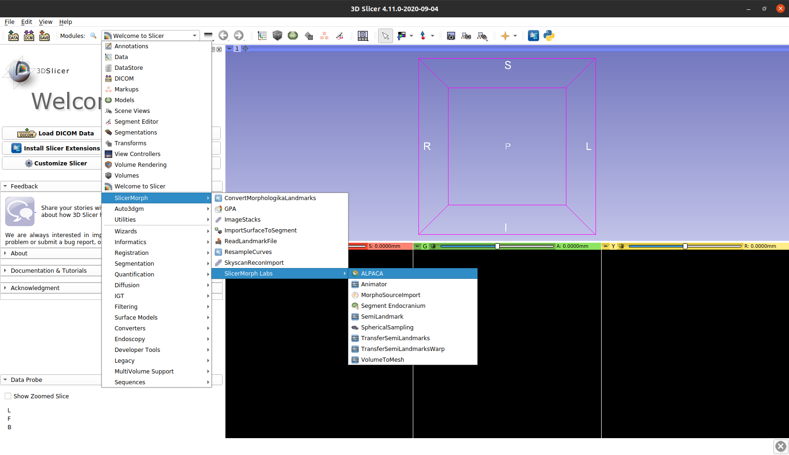
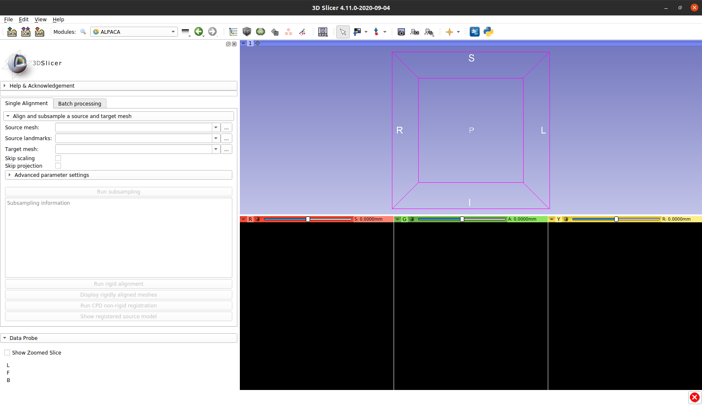

## Automated landmarking through pointcloud alignment and correspondence analysis

`ALPACA` provides fast landmark transfer from a 3D model and its associated landmark set to target 3D model(s) through pointcloud alignment and deformable mesh registration. Unlike the Slicermorph's semi-landmark methods, it does not require presence of fixed landmarks. Optimal set of parameters that gives the best correspondence can be investigated (and outcome can be visualized) in single alignment mode, and then applied to a number of 3D models in batch mode. Invoked first time, `ALPACA` needs your permission to download `open3D` library. Depending on the internet speed, download may take sometime but it is a one-time event.

## Finding ALPACA

Let's start our walk-through by finding `ALPACA` within Slicer. Please find the navigation drop-down menu and then click:
  * __SlicerMorph > SlicerMorph Labs > ALPACA__ 
  

:pencil2:  If this is the first time you are opening `ALPACA`, it will ask you if you are ok with installing `open3d`. If you are using a Windows machine, the installation process can take a few minutes. 

Otherwise, you should observe the following screen:

A closer examination of the module's main menu reveals that there are two main tabs in `ALPACA` : a `Single aligment` and a `Batch processing` one.

## Panels

* __Single alignment options__

  * __Source mesh__: Under the `Source mesh`, the user is expected to select the path to the `*.ply` mesh file to be used as a template
  
  * __Source landmarks__: Under the `Source landmarks`, the user is expected to select the path to the `*.fcsv` file containing the landmarks to be transferred to the target mesh.
  
  * __Target mesh__: Under the `Target mesh`, the user is expected to select the path to the `*.ply` mesh file to be used as a target (i.e., the specimen we are interested in predicting landmark positions for).
  
  * __Skip scaling__: Under the `Skip scaling`, the user is expected to choose whether to isotropically scale the source mesh to match the size of the target mesh.
  
  * __Skip projection__: Under the `Skip projection`, the user is expected to choose whether the pipeline should perform its final and optional post-processing step in which the predicted landmarks are projected to the target surface mesh.

 

 

* Note that the `Single aligment` tab also contains an `Advanced parameter settings` menu that can be expanded. This is generally not recommended for novice users, but hyperparameter tuning can significantly improve the end result. In general, the `Deformable registration` parameters are the most likely ones to improve the quality of the registration. Parameter `Alpha` is a regularization parameter that tends to affect the length of the deformation vectors. Lower values of `Alpha` lead to larger overall deformations, and vice versa. Parameter `Beta`, on the other hand, is a regularization parameter that tends to affect the degree of motion coherence of neighboring points. Large values of `Beta` will lead to greater motion coherence among neighboring points, and vice versa.

 

 

## Tutorials

- [ALPACA tutorial](https://github.com/SlicerMorph/S_2020/tree/master/Lab_ALPACA)

## Contributors

Authors:
- Arthur Porto (Seattle Children's Hospital)
- Sara M. Rolfe (Friday Harbor Laboratories)
- A. Murat Maga (University of Washington)

## Acknowledgements

This module was partially funded by an NSF grant (An Integrated Platform for Retrieval, Visualization and Analysis of 3D Morphology From Digital Biological Collections, award number 1759883) and by a NIH/NIDCR grant (Inbred Mice Strains: Untapped Resource For Genome-Wide Quantitative Association Study For Craniofacial Shape, DE027110) to AMM. We thank participants of the Spring 2020 SlicerMorph Workshop for their valuable feedback on initial iterations of ALPACA.

