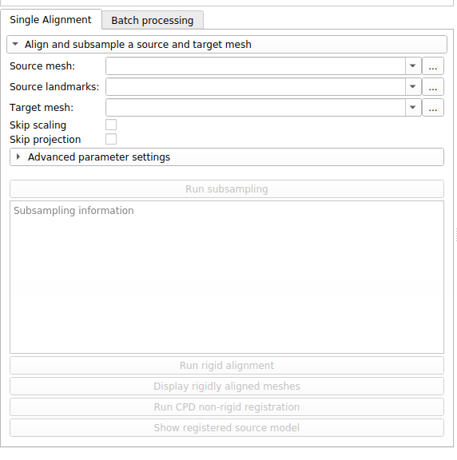
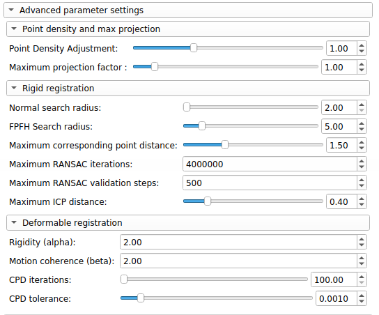

## Automated landmarking through pointcloud alignment and correspondence analysis

`ALPACA` provides fast landmark transfer from a 3D model and its associated landmark set to target 3D model(s) through point cloud alignment and deformable mesh registration. Unlike the Slicermorph's semi-landmark methods, it does not require presence of fixed landmarks. Optimal set of parameters that gives the best correspondence can be investigated (and outcome can be visualized) in single alignment mode, and then applied to a number of 3D models in batch mode. Invoked first time, `ALPACA` needs your permission to download `open3D` library. Depending on the internet speed, download may take sometime but it is a one-time event.

- [Installing ALPACA](installation.md)
- [Finding ALPACA within SlicerMorph](locating.md)

## Panels

A close examination of the module's main menu reveals that there are two main tabs in ALPACA : a Single aligment and a Batch processing one.

* __Single alignment options__

  * __Source mesh__: Under the `Source mesh`, the user is expected to select the path to the `*.ply` mesh file to be used as a template
  
  * __Source landmarks__: Under the `Source landmarks`, the user is expected to select the path to the `*.fcsv` file containing the landmarks to be transferred to the target mesh.
  
  * __Target mesh__: Under the `Target mesh`, the user is expected to select the path to the `*.ply` mesh file to be used as a target (i.e., the specimen we are interested in predicting landmark positions for).
  
  * __Skip scaling__: Under the `Skip scaling`, the user is expected to choose whether to isotropically scale the source mesh to match the size of the target mesh.
  
  * __Skip projection__: Under the `Skip projection`, the user is expected to choose whether the pipeline should perform its final and optional post-processing step in which the predicted landmarks are projected to the target surface mesh.

 

 

Note that the `Single aligment` tab also contains an `Advanced parameter settings` menu that can be expanded. This is generally not recommended for novice users, but hyperparameter tuning can significantly improve the end result. In general, the `Deformable registration` parameters are the most likely ones to improve the quality of the registration.  

 

 

* __Advanced parameter settings__

  * __Point Density Adjustment__: ALPACA automatically chooses the voxel size to be used when sampling the source and target meshes. This setting allows the user to manually adjust the voxel size. Increasing the `Point Density Adjustment` slider will lead to an increase in the number of sampled points in the the target and source meshes, and vice-versa. In general, we recommend users to aim for 5,000 - 6,000 points per point cloud.
  
  * __Maximum projection factor__: As a final and optional post-processing step of the ALPACA pipeline, the predicted landmarks are projected to the target surface mesh. This setting allows users to regulate the amount of maximum displacement that would be allowed in this final step. The default parameter is to limit point displacement to a maximum of 1% of the mesh size. Increasing this value allows larger displacements to occur.
  
  * __Normal seach radius__: Defines the neighborhood of points used when calculating the surface normals in each point cloud. This parameter is defined relative to the voxel size.
  
  * __FPFH search radius__: Defines the neighborhood of points used when computing the FPFH features.This parameter is defined relative to the voxel size.
  
  * __Maximum corresponding point distance__: Defines the maximum distance between two points up to which the points can be considered corresponding to each other when running RANSAC. Larger values are more permissive than lower values.
  
  * __Maximum RANSAC iterations__: Limits the maximum number of iterations that are allowed when running the RANSAC algorithm (rigid alignment).
  
  * __Maximum RANSAC validation steps__: Limits the maximum number of validation steps that are allowed when running the RANSAC algorithm (rigid alignment).
  
  * __Maximum ICP distance__: Defines the maximum distance between two points up to which the points can be considered corresponding to each other when running the local ICP. Larger values are more permissive than lower values.

  * __Rigidity (alpha)__: Parameter `Alpha` is a regularization parameter that affects the length of the deformation vectors. Lower values of `Alpha` lead to larger overall deformations, and vice versa.

  * __Motion coherence (beta)__: Parameter `Beta` is a regularization parameter that tends to affect the degree of motion coherence of neighboring points. Large values of `Beta` will lead to greater motion coherence among neighboring points, and vice versa.

  * __CPD iterations__: Limits the maximum number of iterations that are allowed when running the CPD algorithm (deformable alignment).
  
  * __CPD tolerance__: Tolerance to be used when stopping the CPD algorithm.
  

* __Batch processing__ 

As mentioned in the prior section, the main purpose of the `Single aligmment` tab is to find the best combination of hyperparameters for the task, so that they can be applied to a large array of specimens. In `ALPACA`, the parameters used in `Single alignment` tab get transferred to the `Batch processing` tab once that tab gets selected. 

Note that the `Batch processing` tab has much of the same elements as the `Single alignment` one. The main difference is the addition of a ` Target output landmark directory` box. Before an output directory gets selected, the `Run-autolandmarking` button cannot be pressed. Once pressed, the analysis will proceed by iterating through all `*.ply` files contained in the `Target mesh directory`. Depending on the number of specimens, this will take a considerable amount of time. In most modern laptops, an average of `4-5min` per specimen should be expected. An output `*.fcsv` file will be produced for each specimen using the same name as the original `*.ply` files.

  
  
## Tutorials

- [ALPACA tutorial](https://github.com/SlicerMorph/S_2020/tree/master/Lab_ALPACA)

## Contributors

Authors:
- Arthur Porto (Seattle Children's Hospital)
- Sara M. Rolfe (Friday Harbor Laboratories)
- A. Murat Maga (University of Washington)

## Acknowledgements

This module was partially funded by an NSF grant (An Integrated Platform for Retrieval, Visualization and Analysis of 3D Morphology From Digital Biological Collections, award number 1759883) and by a NIH/NIDCR grant (Inbred Mice Strains: Untapped Resource For Genome-Wide Quantitative Association Study For Craniofacial Shape, DE027110) to AMM. We thank participants of the Spring 2020 SlicerMorph Workshop for their valuable feedback on initial iterations of ALPACA.

