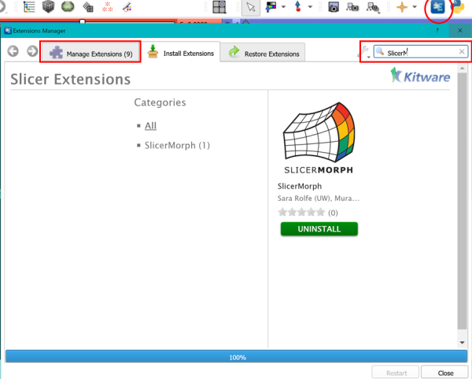
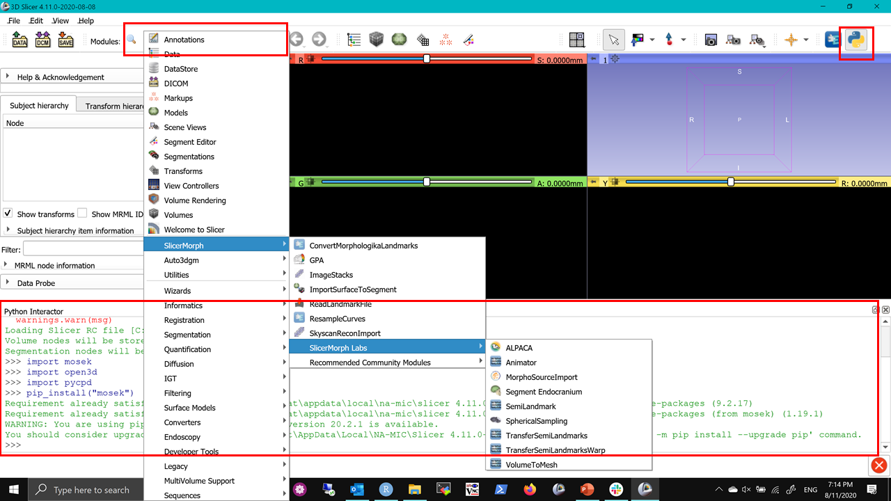

## Installation Instructions:


1. Download the 3D Slicer preview from https://download.slicer.org/?date=2020-09-16. 

2. While installing if you receive warning about security or unknown publisher, ignore and processed with installation. If you are a Mac user you might have to do [these steps to run Slicer after installation](https://discourse.slicer.org/t/unsigned-application-issue-on-mac/12930/2?u=muratmaga).

3. Open extension manager, go to “Install Extensions” tab and search for SlicerMorph and click *install*.
Wait until all 9 extensions are shown under “Manage Extensions” tab, and then click Restart. After the restart, open the module list and see that SlicerMorph is now listed.



4. Click on ALPACA (SlicerMorph->SlicerMorph Labs), this will download and install an external python library called *Open3D*. It is a large library and it may take 5-10 minutes to install, during which Slicer will look like it stalled. Be patient. [Mac users who are using MacOS earlier than 10.15, need to follow this instruction in their Python console.](https://discourse.slicer.org/t/cant-load-open3d/12950/6?u=muratmaga) 


5. If you haven't encountered any issues, at this point you should be set. If you want to be absolutely sure, please type these comments to your python window to double-check:

  ```import open3d```
  
  ```import pycpd```
  
If you end up getting error message about any of these libraries being missing, then you can try manual installation (again type these to your python console):

```pip_install("open3d==0.9.0")```
  
  This will manually install the open3d, for other libraries change the open3d to whatever is missing. 




### Other considerations

* Please do not install Slicer or save any of working data in a cloud syncing drive (e.g., onedrive, dropbox or box) or a network drive. Over the years, we have seen many strange issues, including data corruption and missing files. 

