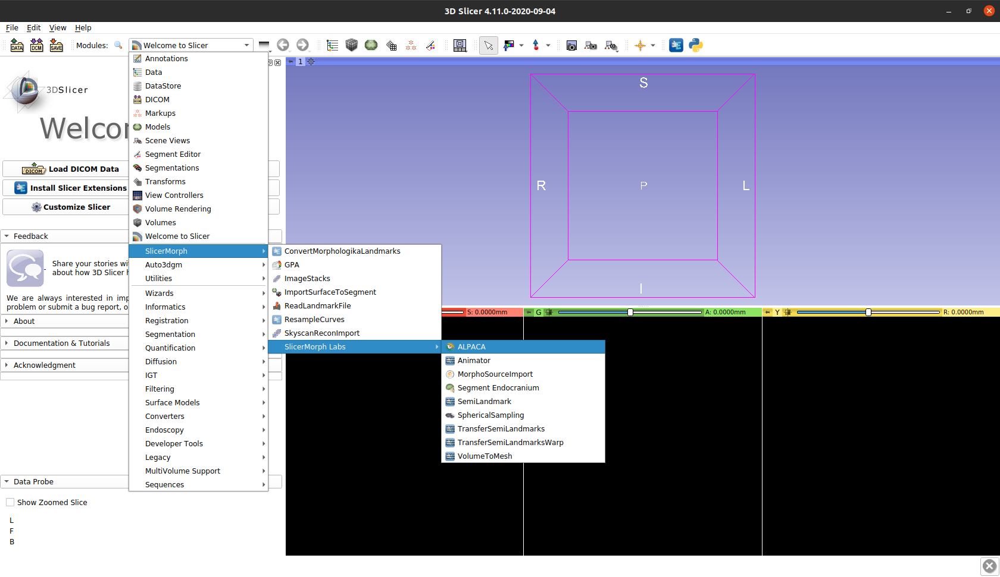

## Finding ALPACA

Please find the navigation drop-down menu and then click:
  * __SlicerMorph > SlicerMorph Labs > ALPACA__ 
  

:pencil2:  If this is the first time you are opening `ALPACA`, it will ask you if you are ok with installing `open3d`. If you are using a Windows machine, the installation process can take a few minutes. 

Otherwise, you should observe the following screen:

