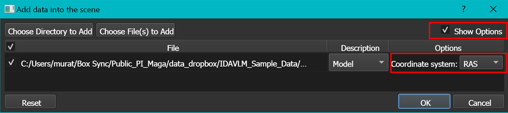

## IDAVLMConverter
**Summary:** This module converts raw landmark coordinates (.pts format) exported from the IDAV Landmark Editor into fcsv format. It does not accept the Landmark Editor's project files (.land format).

### USAGE

User needs to locate a .pts file as the input, and specify the location of the output file.

It should be noted that the 3D Models and coordinates exported from the IDAV Landmark Editor are in RAS coordinate system. By default, Slicer assumes all 3D models to be saved in LPS coordinate, unless explicitly stated. The coordinate system assumption for a 3D model can be changed during the load time by setting the  coordinate system  option from **default** to **RAS** (see below)

We advise verifying the correct conversion by both loading the fcsv file created and the original PLY into SlicerMorph. Also note that, default missing landmark convention in Landmark Editor is to enter value 9999 for all three coordinates. Because Slicer adjusts the field of view of the 3D window to fit all data points, if the converted landmark set has missing landmarks, it will cause the specimen and landmarks to be off-centered in the 3D window.  

