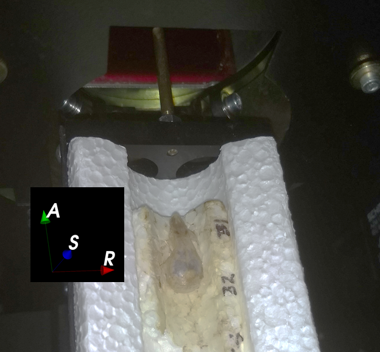

## SkyscanReconImport
**Summary:** Imports non-DICOM image sequences (TIF/PNG/JPG/BMP) generated by the Bruker/Skyscan Nrecon software into 3D Slicer and orients the data to match the canonical anatomical planes.

### USAGE
User needs to locate the **REC.LOG** file generated by the Nrecon sofware. All necessary fields (such as voxel spacing, image dimensions and file prefix) are obtained from the log file. It is important that image sequence is unmodified after the reconstruction (i.e., no renaming, or changing the slice numbers)

A transformation is applied to the image to align it with respect to the anatomical coordinates shown in Slicer. It is assumed that specimen is aligned in the scanner using this convention: Anterior of the specimen is into the scanner, and dorsal (superior) surface is facing up. See below:

### LIMITATIONS
Memory consumption during import is higher than `ImageStacks`. Also, no downsampling or subsetting is possible. If those are important, please use `ImageStacks` module instead.

