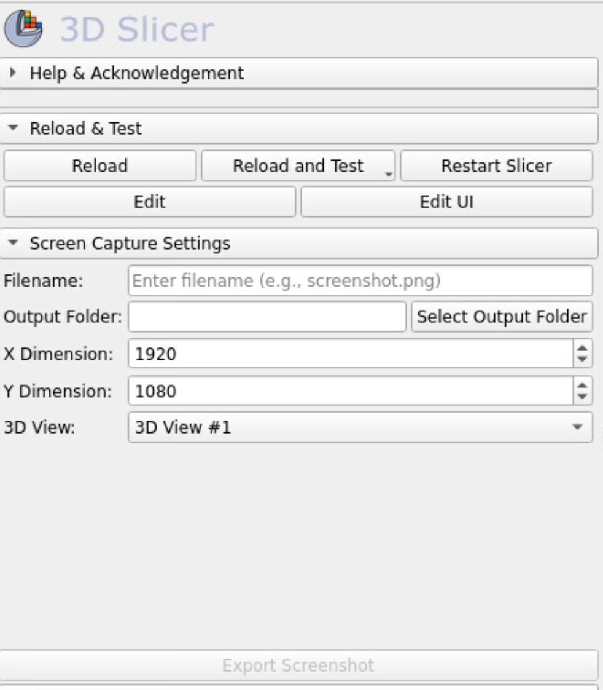

# HiResScreenCapture Module for SlicerMorph

This module is a part of the SlicerMorph extension for 3D Slicer, designed to capture high-resolution screenshots of 3D views within the application.

## Usage

1. **Open SlicerMorph:** Launch 3D Slicer and open the SlicerMorph module.

2. **Access the High Resolution Screen Capture Module:**
   - In the SlicerMorph module, navigate to the `Input and Output` dropdown menu.
   - Look for the `HighResScreenCapture` module in the list of available modules.

3. **Configure Settings:**
   - Enter a filename for the screenshot in the `Filename` field, be sure to include the `.png` extension at the end.
   - Click `Select Output Folder` to choose where the screenshot will be saved.
   - Set the desired resolution for the screenshot using the `X Dimension` and `Y Dimension` fields.
   - Select the 3D view you want to capture from the `3D View` dropdown list.

4. **Capture Screenshot:** Click `Export Screenshot` to capture the screenshot with the specified settings.

5. **Troubleshooting:**
   - If you cannot find the `HighResScreenCapture` module in the SlicerMorph module, ensure that the module is properly installed and enabled.
   - If the `Export Screenshot` button is disabled, ensure that all required settings (filename, output folder, resolution) are properly configured.

6. **Feedback and Support:**
   - For feedback or issues with the High Resolution Screen Capture module, you can contact the SlicerMorph development team or create an issue on the SlicerMorph GitHub repository.

By following these steps, you can easily access and use the High Resolution Screen Capture module within the SlicerMorph module in 3D Slicer.

**Disclaimer:**
    - The current version of HighResScreenCapture will export all visible objects within the selected render window with Markup labels and annotations being the only exception, we hope to incorporate these annotations in the next version.